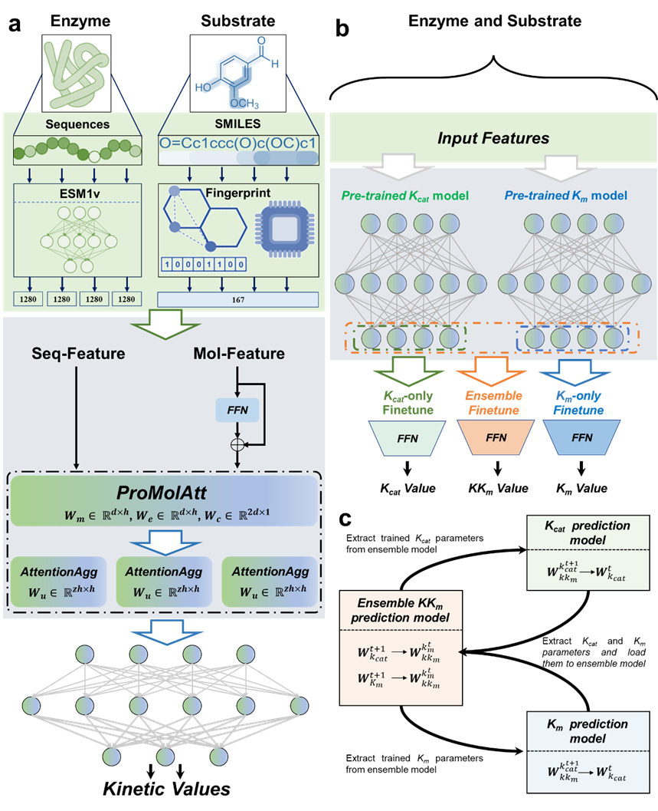

# EITLEM-Kinetics: A Deep Learning Framework for Kinetic Parameter Prediction of Mutant Enzymes
We proposed a novel deep learning model framework and an ensemble iterative transfer learning strategy for enzyme mutant kinetics parameters prediction (**EITLEM-Kinetics**). This approach is designed to overcome the limitations imposed by sparse training samples on the model's predictive performance and accurately predict the kinetic parameters of various mutants. This development is set to provide significant assistance in future endeavors to construct virtual screening methods aimed at enhancing enzyme activity and offer innovative solutions for researchers grappling with similar challenges.
## 1、Overview of the model's framework

## 2、Requirements and Usage
you need to install the following packages in your python envs.
- biopython==1.81
- biotite==0.36.1
- ete3==3.1.3
- fair-esm==2.0.0
- lightning==2.0.2
- lightning-cloud==0.5.34
- lightning-utilities==0.8.0
- numpy==1.24.2
- pytorch-lightning==2.0.2
- rdkit==2023.9.5
- scikit-learn==1.2.2
- scipy==1.10.1
- torch==2.0.1
- torch-geometric==2.3.1
- torch-scatter==2.1.1+pt20cu117
- torch-sparse==0.6.17+pt20cu117

and all the source code is in the /Code/ directory, training and testing code is in the /Notebook/ directory.