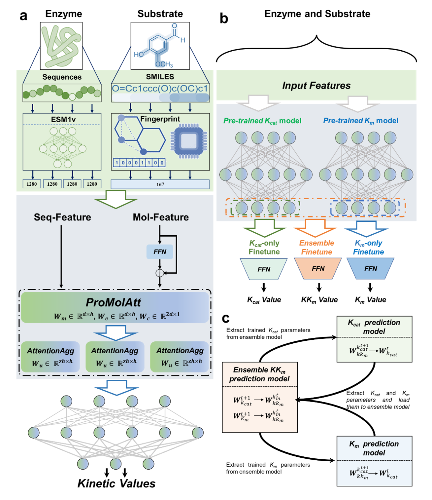

# EITLEM-Kinetics: A Deep Learning Framework for Kinetic Parameter Prediction of Mutant Enzymes
 <br>
Implementation of enzyme kinetic parametes prediction with Eitlem<br><br>

We proposed a novel deep learning model framework and an ensemble iterative transfer learning strategy for enzyme mutant kinetics parameters prediction (**EITLEM-Kinetics**). This approach is designed to overcome the limitations imposed by sparse training samples on the model's predictive performance and accurately predict the kinetic parameters of various mutants. This development is set to provide significant assistance in future endeavors to construct virtual screening methods aimed at enhancing enzyme activity and offer innovative solutions for researchers grappling with similar challenges. 

## Overview of the model's framework
 

## Python Requirements
You need to install the following packages in your python envs, and make sure the Python version >= 3.8

- fair-esm==2.0.0
- numpy==1.24.2
- rdkit==2023.9.5
- scikit-learn==1.2.2
- scipy==1.10.1
- torch==2.0.1
- torch-geometric==2.3.1

<!-- and all the source code is in the /Code/ directory, training and testing code is in the /Notebook/ directory. -->

## Installation Guide
It is recommended to use conda to create a virtual environment to run the code of Eitlem. 

Make sure to install pytorch with the cuda version that fits your device.
```bash
git clone https://github.com/XvesS/EITLEM-Kinetics.git
cd EITLEM-Kinetics
conda create -n eitlem_env python=3.8
conda activate eitlem_env
pip install numpy tqdm torch==2.0.1 torchvision==0.15.2 torchaudio==2.0.2 fair-esm torch_geometric rdkit tensorboard
```

## Reproduce
### 1. Use the following code to generate protein feature
```bash
cd EITLEM-Kinetics/Code
python extract_protein.py
```

### 2.Train model from scratch
```bash
cd EITLEM-Kinetics/Code
python iter_train_scripts.py -i 8 -t iterativeTrain -m MACCSKeys -d 0
```
Parameter definition in the script：
- `-i`: the number of iterations
- `-t`: the name of this training process
- `-m`: molecular fingerprint，optional: `MACCSKeys`, `ECFP`, `RDKIT`
- `-d`: GPU device number, which will use the cpu to train the model if the GPU is not available 

For other parameter definitions, see`./Code/iter_train_scripts.py`

## Directly using Eitlem with trained weights.

### 1. Firstly, you can download all the weights files from **[here](https://doi.org/10.5281/zenodo.16153803)**

Once the download is complete you will get a `Weights.zip`(11G), place it in the `EITLEM-Kinetics/` directory and unzip it

### 2. The code below demonstrates how to use a trained model to predict the kinetic parameters of an enzyme. You need to prepare the amino acid sequence of the enzyme and its corresponding substrate in SMILES format.

```python
import torch
import esm
import sys
from rdkit import Chem
from rdkit.Chem import MACCSkeys
from torch_geometric.data import Data, Batch
import math
sys.path.append("../Code/")
from KCM import EitlemKcatPredictor
from KMP import EitlemKmPredictor
from ensemble import ensemble

modelPath = {
    'KCAT':'../Weights/KCAT/iter8_trainR2_0.9408_devR2_0.7459_RMSE_0.7751_MAE_0.4787',
    'KM':'../Weights/KM/iter8_trainR2_0.9303_devR2_0.7163_RMSE_0.6960_MAE_0.4802',
    'KKM':'../Weights/KKM/iter8-trainR2_0.9091_devR2_0.8325_RMSE_0.7417_MAE_0.4896'
}
# Load ESM1v model
model, alphabet = esm.pretrained.esm1v_t33_650M_UR90S_1()
batch_converter = alphabet.get_batch_converter()
model.eval()

def predict(kinetics_type, sequence, smiles):
    # Extratc protein representation
    data = [
    ("protein1", sequence),
    ]
    _, _, batch_tokens = batch_converter(data)
    batch_lens = (batch_tokens != alphabet.padding_idx).sum(1)
    with torch.no_grad():
        results = model(batch_tokens, repr_layers=[33], return_contacts=False)
    token_representations = results["representations"][33]
    sequence_representations = []
    for i, tokens_len in enumerate(batch_lens):
        sequence_representations.append(token_representations[i, 1 : tokens_len - 1])
    # Compute the MACCS Keys of substrate
    mol = Chem.MolFromSmiles(smiles)
    mol_feature = MACCSkeys.GenMACCSKeys(mol).ToList()

    sample = Data(x = torch.FloatTensor(mol_feature).unsqueeze(0), pro_emb=sequence_representations[0])
    input_data = Batch.from_data_list([sample], follow_batch=['pro_emb'])
    if kinetics_type == 'KCAT':
        eitlem = EitlemKcatPredictor(167, 512, 1280, 10, 0.5, 10)
    elif kinetics_type == 'KM':
        eitlem = EitlemKmPredictor(167, 512, 1280, 10, 0.5, 10)
    else:
        eitlem = ensemble(167, 512, 1280, 10, 0.5, 10)
    
    eitlem.load_state_dict(torch.load(modelPath[kinetics_type]))
    eitlem.eval()
    # Predict kinetics value.
    with torch.no_grad():
        res = eitlem(input_data)
    return math.pow(10,res[0].item())

res = predict("KCAT", 
        "MRAVRLVEIGKPLSLQEIGVPKPKGPQVLIKVEAAGVCHSDVHMRQGRFGNLRIVEDLGVKLPVTLGHEIAGKIEEVGDEVVGYSKGDLVAVNPWQGEGNCYYCRIGEEHLCD\
        SPRWLGINFDGAYAEYVIVPHYKYMYKLRRLNAVEAAPLTCSGITTYRAVRKASLDPTKTLLVVGAGGGLGTMAVQIAKAVSGATIIGVDVREEAVEAAKRAGADYVINASMQD\
        PLAEIRRITESKGVDAVIDLNNSEKTLSVYPKALAKQGKYVMVGLFGADLHYHAPLITLSEIQFVGSLVGNQSDFLGIMRLAEAGKVKPMITKTMKLEEANEAIDNLENFKAIGRQVLIP",
        "COC(=O)C1=CN2CCc3c([nH]c4ccccc34)[C@@]2(C)[C@@H]2CN3CCc4c([nH]c5ccccc45)[C@H]3C[C@H]12")    
print(res) # 1.39

```

## Cite Us

```bibtex
@article{shen2024eitlem,
  title={EITLEM-Kinetics: A deep-learning framework for kinetic parameter prediction of mutant enzymes},
  author={Shen, Xiaowei and Cui, Ziheng and Long, Jianyu and Zhang, Shiding and Chen, Biqiang and Tan, Tianwei},
  journal={Chem Catalysis},
  year={2024},
  publisher={Elsevier}
}
```
